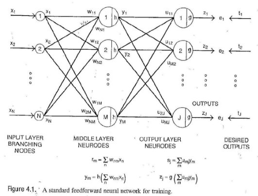
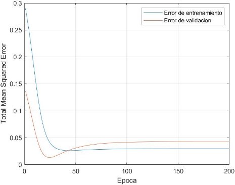
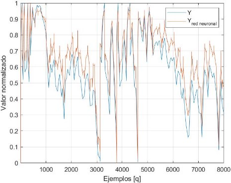

**Algoritmo de retropropagación del error para predicción de sistemas**

**dinámicos por redes neuronales en Matlab**

Universidad Nacional de Colombia Sede Bogotá

Control inteligente

Jose Ricardo Rincón Peláez

Este documento implementa el algoritmo de retropropagación del error usando como referencia el trabajo realizado por Carl G. Looney en el libro *Pattern Recognition Using Neural Networks* y lo aplica al modelamiento de dinámico de sistemas NARX. El contenido consiste en una introducción al modelo general de una red neuronal y descripción del algoritmo de retropropagación, para luego

tratar el tema de las redes neuronales dinámicas a la par que se ejemplifica con una serie de datos prevista.

**Introducción teoríca**

En el libro de Looney se menciona la estructura y notación para una red neuronal de solo una capa intermedia en la siguiente figura.

Esta arquitectura es conocida como *N-M-J*, haciendo referencia a la cantidad de neurodos de

entrada (N), de capa intermedia (M) y de salida (J). La notación para los vectores correspondientes es *x*, *y, z* y los resultados esperados (uno para cada salida) se denominan *t*. En la misma figura se diferencian las operaciones que realizan los neurodos de capa de salida e intermedia. Allí *g* y *h* son las funciones de activación, que para los cálculos posteriores se eligió sigmoide unipolar. Un sigmoide unipolar sigue la ecuación:

1

*f* (*x*) = 1 + *e*−(*α x*+*b*)

Siguiendo el desarrollo del libro se expone que para la actualización de los pesos de los neurodos de capa intermedia y de salida de la red neuronal se aplica gradiente descendiente, que es un algoritmo de optimización. Luego se llega a la siguiente expresión matemática.

*u*(*r*+1) ← *u*(*r*) + *η*1 *t*(*q*) − *z*(*q*) *z*(*q*) 1 − *z*(*q*) *y*(*q*)

mj mj *j j j j m*

nm(*r*) + *η*2  *J j*(*q*) − *zj*(*q*) (*q*) 1 − *zj*(*q*) *u*mj  *y*

*w*(*r*+1) ← *w t z* (*q*) (*q*) 1 − *y*(*q*) *x*(*q*) nm *j n m n*

*j*=1

Allí el índice *q* indica el ejemplo de la base de datos de entrenamiento que va de 1 a *Q* ejemplares. También tal como está planteada la expresión, se identifica que la actualización de pesos ocurre cada época. Una época se cumple una vez se han pasado todos los ejemplares de la base de datos de entrenamiento, luego *r* va de 1 hasta *I*, siendo *I* el número de épocas. Además, se identifica las variables *η*1y *η*2 que son la taza de actualización,

**Algoritmo de retropropagación**

Posteriormente para una implementación computacional se debe desarrollar un algoritmo que aplique las ecuaciones anteriores. En este punto se considera por regla genera que se tiene una base de datos de entrada donde solo el 70% de ellas se usa para entrenamiento y el 30% restante es de validación. Luego el algoritmo de retropropagación explicada por Looney se ve en la siguiente figura.

**Modelamiento de sistemas NARX**

Tal como se menciona en el guía de usuario del toolbox de Matlab *Deep Learning*, una de las aplicaciones de las redes neuronales son los sistemas de control. En particular un sistema dinámico que pueda ser representado con series de tiempo tipo NARX (Nonlinear autoregressive exogenous model), también puede ser modelado con una red neuronal, en un enfoque de caja negra. La ecuación general de un sistema NARX en tiempo discreto y en modo de predicción es la siguiente:

*y* (*k* + 1) = *f* (*y* (*k*) *,y* (*k* − 1) *,y* (*k* − 2) *, ...y* (*k* − *ny* + 1) *,u* (*k*) *,u* (*k* − 1) *,u* (*k* − 2) *, ...u* (*k* − *nu* + 1)) Siendo *ηy*y *ηu* los órdenes de regresión de la salida (parte autorregresiva) y de las entradas externas

(parte exógena).

Para ello, la estructura estándar de una red neuronal se modifica como indica la siguiente figura.

La salida se indica como *y*ˆ dado que no es exactamente *y* sino una predicción hecha por la red neuronal. Como veremos a continuación, para el entrenamiento de la red neuronal se cuentan con las entradas y salidas de un sistema dinámico, más no se conoce una función de transferencia o ningún modelamiento clásico de este. Sin embargo, con la aplicación de una red neuronal dinámica es posible realizar dicho modelamiento.

clear, clc;

**Implementación en Matlab**

La implementación en Matlab sigue los siguientes pasos expuestos por Looney en su algoritmo y modificados para la aplicación de modelamiento NARX.

**Paso 1.** Definición de entradas y salidas esperadas, además de los vectores y parámetros necesarios para definir la red neuronal *N-M-J y* los órdenes de regresión del modelo NARX.

Parámetros de diseño:

- se quiere una regresion de 2 para ambas partes ny = 2;

nu = 2;

N = ny+nu; % Numero de neurodos en capa de entradas M = 7; % Numero de neurodos en capa oculta

J = 1; % Numero de neurods en capa de salida

I = 200; % Numero de epocas

Se carga el archivo con los datos de entrenamiento y validación.

load cstr\_tr\_data.mat

U = tr\_dat.U; % Parte exogena

Y = tr\_dat.Y; % Parte autoregresiva y salidas esperadas Ts = tr\_dat.Ts; % Tiempo de muestreo de los datos

Es necesario normalizar los datos de entrada de la red para que esta no se sature. La saturación ocurre porque al usar una función sigmoide rango de *[0,1]* y si se tiene un valor muy grande, dígase *x* = 5, el valor resultante ya es *0.993.* Si esto ocurre, el gradiente ya es muy grande y la red puede no converger a nada. El caso opuesto *x* = −5 tiene el efecto contrario que es un entrenamiento demasiado lento [2].

- normalizamos las entradas

U = U - min(U); % quitamos offset U = U/(max(U)); % normalizamos

Y = Y - min(Y); % quitamos offset

Y = Y/(max(Y)); % normalizamos

Vectores de la red neuronal con las dimensiones y sus etiquetas siguiendo la notación de la sección anterior.

Q = length(U)-nu; % Cantidad de total de ejemplos Qt = round(Q\*0.7); % Ejemplos de entrenamiento Qv = round(Q\*0.3); % Ejemplos de validacion

x = zeros(Q,N); % Vector de entradas

w = zeros(I,N,M); % Vector de pesos de capa intermedia y = zeros(Q,M); % Vector de salida de capa intermedia u = zeros(I,M,J); % Vector de pesos de capa de salida z = zeros(I,Q,J); % Vector de salidas

t= Y(1:end-ny); % Vector de objetivos

e = zeros(Qt,J); % Vector de error de entrenamiento E = zeros(1,I); % Vector de MSE entrenamiento total de epoca ev = zeros(Qt,J); % Vector de error de validación Ev = zeros(1,I); % Vector de MSE validcacion total de epoca

**Paso 2.** Definición de parámetros de las funciones de activación y actualización de pesos. De estos parámetros depende (junto con el número de neurodos de capa intermedia M) el comportamiento de la red neuronal, su aprendizaje.

- Para sigmoide de la función de activacion h alpha1 = 5;

beta1 = 0.01;

- Para sigmoide de la funcion de activacion g alpha2 = 2;

beta2 = 0.01;

- Para las ecuaciones de actualizacion de peso eta1 = 0.25;

eta2 = 0.25;

**Step 3.** Generación aleatoria de pesos iniciales para capa intermedia y de salida.

for m=1:M

for n=1:N

w(1,n,m) = rand() -0.5; end

for j=1:J

u(1,m,j) = rand() -0.5;

end

end

**Step 4.** Ajuste de pesos por medio del método de gradiente descendiente. Acá se debe tener en

cuenta que las entradas se dividen en exógenas y autorregresivas, más se agrupan en el vector *x* para cada iteración.

- Bucle hasta completar iteraciones

for r=1:I

- Division de donde empizan los datos de valdiacion qv=Qt;
- Se seleccionan los pesos de la iteración correpondiente ui = u(r,:,:); wi = w(r,:,:);
- Bucle que recorre los ejemplares for q=ny:Qt
  - Vector de datos de entrada para este ejemplo de entrenamiento xq = zeros(1,ny+nu); for i=0:nu-1
    - se cogen como primeras dos entradas u(k) y u(k-1) xq(i+1) = U(q-i);

end

for i=0:ny-1

- se cogen como segundas dos entradas y(k) y y(k-1) xq((nu+i)+1) = Y(q-i);

end

- Se calcula la salida con los datos de la epoca y del ejemplar [ymq, zjq] = Update\_NN(N,M,J,xq,ui,wi,alpha1,alpha2,beta1,beta2);
- los resultados se almacenan

y(q,:) = ymq;

z(r,q,:) = zjq;

- Se calcula el error de este ejemplar

e(q,:)= (t(q+1,:)-z(r,q,:))^2;

- Actualización de pesos con las ecuaciones for m=1:M

for j=1:J

- Pesos de capa intermedia para la siguiente iteracion u(r+1,m,j) = u(r,m,j)+eta1\*( (t(q+1,j) ... -z(r,q,j))\*(z(r,q,j)\*(1-z(r,q,j)))\*y(q,m) ); end

for n=1:N

- Pesos de capa de salida para la siguiente iteracion w(r+1,n,m) = w(r,n,m)+eta2\*( sum( (t(q+1,:)... -z(r,q,:))\*(z(r,q,:)\*(1-z(r,q,:)))\*u(r,m,:) )... \*y(q,m)\*(1-y(q,m))\*xq(n) );

end

end

- indice que recorre los datos de validación
- como estos son menos que los de entrada una vez alcanzado
- el limite se reinicia

qv = qv+1;

if qv == Q+1

qv = 1+Qt;

end

- Vector de datos de entrada para este ejemplo de validación xqv = zeros(1,ny+nu);

for i=0:nu-1

- se cogen como primeras dos entradas u(k) y u(k-1) xqv(i+1) = U(qv-i);

end

for i=0:ny-1

- se cogen como segundas dos entradas y(k) y y(k-1) xqv((nu+i)+1) = Y(qv-i);

end

- Se calcula la salida con los datos de la epoca y del ejemplar [ymqv, zjqv] = Update\_NN(N,M,J,xqv,ui,wi,alpha1,alpha2,beta1,beta2);
- los resultados se almacenan

y(qv,:) = ymqv;

z(r,qv,:) = zjqv;

- Se calcula el error de este ejemplar

ev(q,:)= (t(qv,:)-z(r,qv,:))^2;

end

- Calculo del TMSE para esta iteracion tanto en
- entrenamiento como en validación

E(r) = sum(sum(e))/(Qt\*J);

Ev(r) = sum(sum(ev))/(Qt\*J);

end

**Resultados**

Finalmente, los resultados se almacenaron en los vectores de error total que corresponde al *Total Mean Squared Error*. Este es:

*E* TMSE =

QJ

donde *E* es:

*Q*

*E* = *t*(*q*) − *z*(*q*)| 2

*q*=1

La gráfica de los TMSE de entrenamiento y validación contra las épocas da como resultado dos formas diferentes. El error de entrenamiento se aproxima a cero y la de error de validación tiene una forma peculiar. Puede suceder que la red neuronal se sobre entrena y pierda generalidad. En dicho caso solo será capaz de clasificar o dar el resultado esperado para los datos de entrenamiento. Para evitar esto se elige la iteración tal que el error de entrenamiento es mínimo.

figure,

%plot(1:I-1,[E; Ev]), grid,

plot(1:I,[E; Ev]), grid,

legend(["Error de entrenamiento" "Error de validación"]) ylabel(  Total Mean Squared Error  ), xlabel(  Época  );

Encontramos la época donde el error de validación es mínimo para extraer los valores de pesos óptimos.

Indice\_optimo = find(Ev==min(Ev)) Indice\_optimo = 24

Ahora podemos comparar los datos reales del sistema contra los "predecidos" por la red neuronal en la iteración de validación de mínimo error. No sin antes normalizar de igual forma los valores de la salida estimada.

- Normalizacion de la salida como se hizo en la carga de datos z\_real = z(Indice\_optimo(1),:)-min(z(Indice\_optimo(1),2:end)); z\_real = z\_real/max(z\_real);

%figura comparativa

plot([t z\_real  ]), legend(["Y" "Y\_{red neuronal}"]), xlim([2,8000]); grid, xlabel("Ejemplos [q]"), ylabel("Valor normalizado")

Los resultados reflejan el buen funcionamiento de la red neuronal, si bien no todos los puntos son proyectados al pie de la letra si se puede ver como se sigue el patrón. Incluso para los datos de validación (desde q=5600 en adelante) que son nuevos para la red.

**Métricas de validación de resultados**

Entre las métricas más usadas está el MSE (Mean Squared Error) y el VAF (Variance Accounted For). Evaluadas en la mejor iteración se tiene:

MSE = 100\*Ev(Indice\_optimo(1))

MSE = 1.3224

VAF = 100\*( 1 - (var(t(2:end)-z\_real(2:end)  )/var(t(2:end) )) ) VAF = 92.5146

Las métricas contrastan el buen desempeño de la red, si esta fuese perfecta tendríamos un *MSE=0* y un *VAF=100*.

**Conclusiones finales**

Las redes neuronales tienen múltiples aplicaciones por su capacidad de resolver tareas complejas con "poco" esfuerzo. Sin embargo, en la creación de este documento se evidenció que en la etapa de diseño, si bien no requiere mucho esfuerzo, pues basta con cambiar los parámetros (*ηi ,α i ,M,β i*) o reiniciar el programa para una nueva aleatorización de pesos, si es un proceso lento y poco intuitivo. Se conocen ciertas relaciones como el error final y el número de neurodos, la pendiente de caída de la gráfica de MSE y las tazas de aprendizaje, pero en general es un ejercicio de prueba y error. El modelamiento de sistemas con esta metodología es radicalmente diferente a enfoques clásicos como variables de estado o funciones de transferencia, pero para problemas complejos sus beneficios son evidentes y está demostrado por lo visto anteriormente que no se requiere de la matemática

avanzada que si exigen los enfoques tradicionales.

En cuanto al desempeño final, hay campo de mejora en la optimización de los parámetros y también en algoritmos más precisos con ciertas mejoras sobre el presentado. Citando la guía de usuario del Toolbox de Matlab: "Aunque las redes neuronales dinámicas pueden ser entrenadas con algoritmos basados en gradiente usados en redes estáticas, el rendimiento de dichos algoritmos en redes dinámicas es diferente, y el gradiente debe ser calculado en una manera más compleja" [2]. Otras mejoras se hallan el uso de una función de activación sigmoide bipolar, aumento de capas intermedias, o redes de base radial. Dichas modificaciones implican un cambio en las ecuaciones de actualización de pesos.

Así mismo, Looney señala las siguientes desventajas: 1) el *moving target effect*, puesto el ajuste de pesos es función de todos los pesos para un peso específico se está añadiendo un error extra en cada época. Este defecto es señalado por el autor como un "fact of life with MLPs (Multilayer

Perceptron)" [1]. 2) *local mínima,* que hace referencia a que la red puede converger en mínimo que es solo local y no global, pues, el gradiente desciende, pero no tiene la "fuerza" para superar la siguiente cresta y queda estancado allí. Dicho inconveniente es abordado usualmente con un término de *momentum*.

**Calculo de la red neuronal**

La función **update\_NN()** da los resultados de la red neuronal una vez se usan los pesos actualizados siguiendo las ecuaciones expuestas en la sección teoríca.

function [ym,zj] = Update\_NN(NN,MM,JJ,xx,uu,ww,aa1,aa2,bb1,bb2)

ym = zeros(1,MM);

for m=1:MM

rm=0;

for n=1:NN

rm = rm+ ww(1,n,m)\*xx(1,n);

end

ym(m) = 1/(1+exp(-aa1\*rm +bb1)); end

zj = zeros(1,JJ);

for j=1:JJ

sj=0;

for m=1:MM

sj = sj + uu(1,m,j)\*ym(m); end

zj(j) = 1/(1+exp(-aa2\*sj +bb2));

end

end **Referencias**

1. Pattern Recognition using Neural Networks: theory and algorithms for engineers and scientists, Carl G. Looney, Oxford University Press, 1997.
1. Deep Learning Toolbox Users Guide, Mark H. Beale, Martin T. Hagan, Howard B. Demuth, Matlab, 2022.
11
